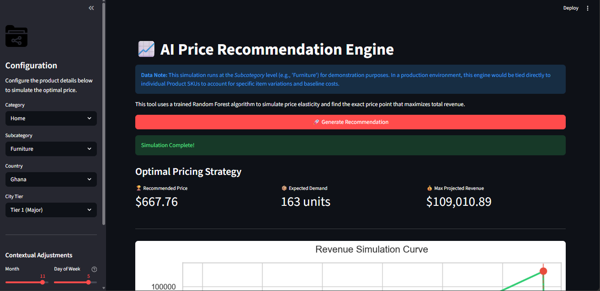
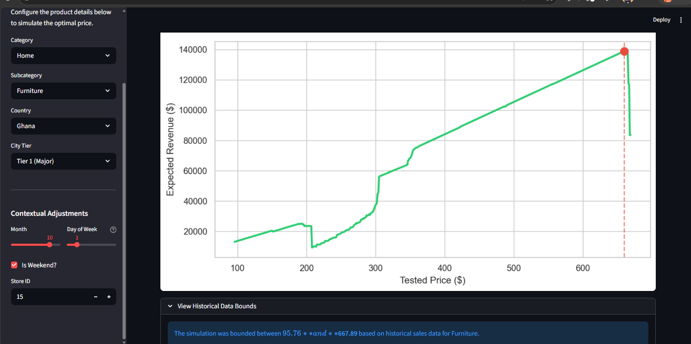

# 📈 AI Price Recommendation Engine



An end-to-end Machine Learning pipeline and interactive web application that analyzes retail sales data to simulate price elasticity, identify consumer psychological barriers, and recommend revenue-maximizing price points.

---

## 📋 Business Problem & Solution

Retailers often rely on gut-feeling or basic cost-plus margins for pricing. This project replaces guesswork with data-driven simulation.

By training a **Random Forest Regressor** on ~4.5 million historical retail transactions across 5 African countries, this engine learns the complex relationship between seasonality, geographic location (Tier 1 vs Tier 2 cities), product categories, and demand. The resulting Streamlit web application allows stakeholders to instantly visualize the "revenue curve" and find the exact price point before demand collapses.

---

## 🚀 The Web Application

The project features a fully interactive dashboard built with **Streamlit**.



### Key App Features

- **Dynamic Scenarios:** Users can configure product categories, store locations, and temporal contexts (e.g., weekend holiday shopping).
- **Bounded Reality Checks:** The app dynamically queries the dataset to find the highest historical price for a specific category, preventing the ML model from hallucinating outside the bounds of reality.
- **Instant Revenue Curves:** Visualizes the simulated price elasticity, clearly marking the "Price Cliffs" where consumer demand drops off.

---

## 🧠 Machine Learning Engine & Insights

### The Algorithm

- **Model:** `RandomForestRegressor`
- **Feature Engineering:** Implemented **Target Encoding** for high-cardinality categorical variables (like `store_id`) to prevent memory crashes and model bloat.
- **Evaluation:** Optimized for predicting *Demand*, which is then mathematically multiplied by the *Simulated Price* to find maximum expected revenue.

### Key Business Discoveries

1. **The Price Cliff ($650 Barrier):**  
   The model successfully identified psychological pricing barriers. For example, mid-tier electronics show steady revenue growth up to ~$650, after which demand mathematically falls off a cliff.

2. **Price Endogeneity (The 0.21 Correlation):**  
   Exploratory analysis showed a weak *positive* correlation (0.21) between price and demand. The model learned that this is driven by the "Brand Premium" effect—expensive flagship products natively generate higher demand due to brand loyalty, rather than the price itself driving the demand.

---

## 🏗️ Production Constraints & Future Architecture

This prototype was built to demonstrate core ML mechanics. In a true enterprise deployment, the following architectural upgrades would be implemented:

- **Data Layer Migration (NeonDB / PostgreSQL):**  
  Currently, the Streamlit app loads a 100MB+ processed CSV into RAM. For production, the data layer would migrate to a cloud SQL database, queried via a FastAPI backend to drastically reduce UI load times and memory footprint.

- **Granularity Shift (Subcategory ➡️ SKU):**  
  The current model aggregates elasticity at the "Subcategory" level (e.g., *Phones* or *Furniture*). A production engine would train at the individual **Product ID (SKU)** level to account for specific item variations and baseline manufacturing costs.

- **Algorithm Evolution (XGBoost):**  
  Tree-based models like Random Forests struggle with extreme extrapolation (they freeze predictions at the edge of their training data). Future iterations will test XGBoost or localized linear models to better capture non-linear elasticity at the extremes.

---

## 🗂️ Project Structure

```text
portfolio-1-start/
├── data/
│   ├── raw/
│   │   └── retail_sales.csv
│   └── processed/
│       └── cleaned_retail_sales.csv  # Engineered & enriched dataset
├── models/
│   ├── demand_prediction_model.pkl   # Trained Random Forest
│   └── target_encoder.pkl            # Trained category encoder
├── notebooks/
│   ├── 01_data_cleaning.ipynb        # ETL Pipeline
│   ├── 02_eda_and_features.ipynb     # Exploratory Data Analysis
│   └── 03_price_optimization.ipynb   # ML Training & Simulation Logic
├── app.py                            # Streamlit Web Dashboard
├── requirements.txt
└── README.md
```

---

## 🌍 Data Scope & Engineering

The underlying data pipeline processes massive amounts of simulated transaction history to create a realistic environment for the ML model:

- **Scale:** ~4.5 million retail transactions.
- **Geography:** Nigeria, Kenya, South Africa, Ghana, Egypt (segmented by Tier 1 and Tier 2 cities).
- **Demand Engineering:** Engineered realistic market behavior (Tier 1 cities exhibiting 2.5x higher baseline demand than Tier 2).

---

## 💻 Quick Start Guide

### 1. Clone & Setup

```bash
git clone https://github.com/yourusername/Price-Recommendation.git
cd Price-Recommendation
```

### 2. Create Virtual Environment

```bash
conda create -n portfolio-1-start python=3.10
conda activate portfolio-1-start
```

### 3. Install Dependencies

```bash
pip install -r requirements.txt
```

### 4. Run the Web Application

```bash
streamlit run app.py
```

*The dashboard will automatically open in your browser at `localhost:8501`.*

---

## 🔧 Technology Stack

- **App Development:** Streamlit
- **Machine Learning:** Scikit-learn, Category Encoders, Joblib
- **Data Processing:** Pandas, NumPy
- **Visualization:** Matplotlib, Seaborn

---

## 👨‍💻 Author

**Ginikachukwu Edward**

*Built as a portfolio project demonstrating Full-Stack Data Science—from raw data engineering to deployed business intelligence.*